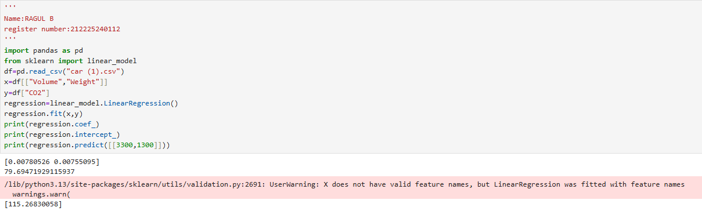

# Implementation of Multivariate Linear Regression
## Aim
To write a python program to implement multivariate linear regression and predict the output.
## Equipment’s required:
1.	Hardware – PCs
2.	Anaconda – Python 3.7 Installation / Moodle-Code Runner
## Algorithm:
### Step1
Import pandas for data handling.
Import LinearRegression from sklearn for building the model.

### Step2
Read the CSV file "car (1).csv" into a dataframe df.

### Step3
Select input (independent variables):Volume,Weight.

### Step4
Show:Coefficients,Intercept,Predicted CO₂ value


### Step5

end of program

## Program:
```
import pandas as pd
from sklearn import linear_model
df=pd.read_csv("car (1).csv")
x=df[["Volume","Weight"]]
y=df["CO2"]
regression=linear_model.LinearRegression()
regression.fit(x,y)
print(regression.coef_)
print(regression.intercept_)
print(regression.predict([[3300,1300]]))

```
## Output:


## Result
Thus the multivariate linear regression is implemented and predicted the output using python program.